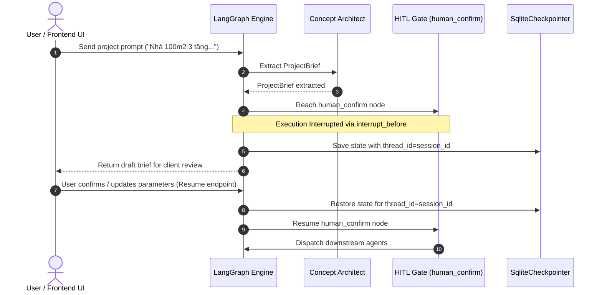

# Human-In-The-Loop (HITL) Gate Pattern

## Overview

In construction cost estimation, automatically running downstream calculations or external market lookups based on unverified parameters can lead to inaccurate estimates and unnecessary computational overhead.

The **HITL Confirmation Gate Pattern** uses LangGraph's `interrupt_before` capability to pause graph execution right after parameter extraction (`planner_node`). The user is presented with the extracted parameters (`ProjectBrief`) in the UI, allowed to modify inputs (such as land area, number of floors, or quality tier), and explicitly resume execution.



---

## Pattern Implementation Code (Reference)

```python
from langgraph.checkpoint.sqlite import SqliteSaver
from langgraph.graph import StateGraph, END
from foundation.schemas import AgentState

# ── 1. Define Human Confirmation Node ─────────────────
def human_confirm_node(state: dict) -> dict:
    """Pass-through node acting as the execution pause boundary."""
    print("[HUMAN_CONFIRM] User approved parameters. Proceeding with execution.")
    return {}

# ── 2. Build Graph with Interruption Rule ─────────────
graph_builder = StateGraph(AgentState)

graph_builder.add_node("planner", planner_node)
graph_builder.add_node("human_confirm", human_confirm_node)
graph_builder.add_node("parallel_dispatcher", parallel_dispatcher_node)

# Conditional routing from planner
def route_after_planner(state: dict) -> str:
    plan = state.get("plan")
    if not plan:
        return "__end__"
    return "human_confirm"

graph_builder.add_conditional_edges("planner", route_after_planner, {
    "human_confirm": "human_confirm",
    "__end__": END,
})

# ── 3. Compile Graph with Checkpointer & Interrupt ─────
checkpointer = SqliteSaver.from_conn_string(":memory:")

app = graph_builder.compile(
    checkpointer=checkpointer,
    interrupt_before=["human_confirm"]  # Pauses BEFORE human_confirm runs
)

# ── 4. Resume Flow via FastAPI Endpoint ────────────────
def resume_hitl_execution(session_id: str, updated_brief: dict):
    config = {"configurable": {"thread_id": session_id}}
    
    # Update state with user edits if provided
    if updated_brief:
        app.update_state(config, {"plan": {"constraints": updated_brief}})
        
    # Resume graph by passing None input
    events = app.stream(None, config, stream_mode="values")
    return events
```

---

## Key Operational Rules

1. **Session Binding**: Always preserve `thread_id=session_id`. LangGraph state checkpointers rely on `thread_id` to locate interrupted states.
2. **Deterministic Inputs**: The client UI displays the exact json draft from `state["plan_draft"]` or `state["plan"]["constraints"]`.
3. **Clean Resume**: Resuming execution sends `None` as the input payload to `app.stream(None, config)` to continue from the interrupted node.
